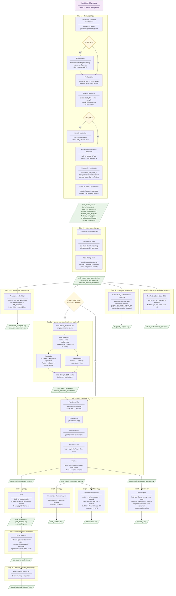

```mermaid
flowchart TD

    INPUT["TraceFinder CSV exports<br/>─────────────────────<br/>DATA/ — one file per injection"]

    INPUT --> S1_load

    subgraph S1["Step 1 — data_import.py"]
        S1_load["File loading + sample classification<br/>────────────────────<br/>samples vs blanks<br/>group assignment by prefix"]
        S1_load --> S1_align_gate{ALIGN_RT?}
        S1_align_gate -->|"Yes"| S1_align["RT alignment<br/>────────────────────<br/>reference = first alphabetically<br/>merge_asof on m/z<br/>shift = median(ΔRT)"]
        S1_align_gate -->|"No"| S1_pool
        S1_align --> S1_pool["Peak pooling<br/>────────────────────<br/>flatten all files → list of peaks<br/>(sample, rt, mz, area, score)"]
        S1_pool --> S1_cluster["Feature detection<br/>────────────────────<br/>sort peaks by RT → mz → sample<br/>greedy RT clustering (RT_MARGIN)"]
        S1_cluster --> S1_mz_gate{USE_MZ?}
        S1_mz_gate -->|"Yes"| S1_mz["m/z sub-clustering<br/>────────────────────<br/>split clusters where<br/>Δm/z > MZ_TOLERANCE"]
        S1_mz_gate -->|"No"| S1_dup
        S1_mz --> S1_dup["Within-cluster duplicate resolution<br/>────────────────────<br/>split on largest RT gap<br/>until ≤1 peak per sample"]
        S1_dup --> S1_meta["Feature ID + metadata<br/>────────────────────<br/>ID = mean_mz_mean_rt<br/>best peak by score tiebreaker<br/>sample_areas dict per feature"]
        S1_meta --> S1_matrix["Blank ref table + peak matrix<br/>────────────────────<br/>matrix: features × samples<br/>blanks: max area per feature"]
    end

    S1_matrix --> OUT1

    OUT1[/"peak_matrix_raw.csv<br/>blank_features.csv · blank_per_feature.csv<br/>feature_metadata.csv · feature_name_map.csv<br/>feature_peak_log.csv · rt_alignment_shifts.csv<br/>sample_groups.csv"/]

    OUT1 --> S2_load

    subgraph S2["Step 2 — blank_correction.py"]
        S2_load["Load blank-corrected matrix"]
        S2_load --> S2_mz["Optional m/z gate<br/>────────────────────<br/>per-blank-file m/z matching<br/>with configurable tolerance"]
        S2_mz --> S2_fc["Fold-change filter<br/>────────────────────<br/>sample area / blank area<br/>remove if below FC threshold<br/>full per-comparison audit log"]
    end

    S2_fc --> OUT2

    OUT2[/"peak_matrix_blank_corrected.csv<br/>blank_correction_audit.csv<br/>features_removed_blank.csv"/]

    OUT2 --> S2b_load
    OUT2 --> S2c_gate
    OUT2 --> S7b_load
    OUT2 --> S8_load

    subgraph S2b["Step 2b — prevalence_histogram.py"]
        S2b_load["Prevalence calculation<br/>────────────────────<br/>detection fraction per feature<br/>bin edges aligned to 1/N_samples<br/>PCA + HCA threshold lines"]
    end

    S2b_load --> OUT2b

    OUT2b[/"prevalence_histogram.png<br/>prevalence_summary.csv"/]

    S2c_gate{RUN_COMPOUND<br/>CLASSIFICATION?}
    S2c_gate -->|"Yes"| S2c_load
    S2c_gate -->|"No"| S3_load

    subgraph S2c["Step 2c — compound_classification.py  (optional)"]
        S2c_load["Read feature_metadata.csv<br/>compound_name column"]
        S2c_load --> S2c_cid["PubChem REST<br/>name → CID → MolFormula<br/>+ IUPACName + SMILES + InChIKey"]
        S2c_cid --> S2c_cf["ClassyFire<br/>InChIKey → kingdom / superclass<br/>/ class / subclass / direct_parent"]
        S2c_cid --> S2c_np["NPClassifier<br/>SMILES → pathway / superclass / class"]
        S2c_cf --> S2c_cache["Write-through JSON cache<br/>(pubchem_cache.json)"]
        S2c_np --> S2c_cache
    end

    S2c_cache --> OUT2c

    OUT2c[/"compound_classes.csv<br/>feature_metadata_enriched.csv"/]

    OUT2c --> S3_load

    subgraph S3["Step 3 — normalization.py"]
        S3_load["Prevalence filter<br/>────────────────────<br/>per-analysis threshold<br/>(PCA / HCA / Volcano)"]
        S3_load --> S3_excl["Exclusion list<br/>(PCA matrix only)"]
        S3_excl --> S3_norm["Normalization<br/>────────────────────<br/>pqn / sum / median / none"]
        S3_norm --> S3_log["Log transform<br/>────────────────────<br/>log2 / log10 / ln / sqrt / cbrt / none"]
        S3_log --> S3_scale["Scaling<br/>────────────────────<br/>pareto / auto / vast / range / level / none<br/>(forced none for volcano)"]
    end

    S3_scale --> OUT3_pca & OUT3_hca & OUT3_vol

    OUT3_pca[/"peak_matrix_processed_pca.csv"/]
    OUT3_hca[/"peak_matrix_processed_hca.csv"/]
    OUT3_vol[/"peak_matrix_processed_volcano.csv"/]

    OUT3_pca --> S4_run
    OUT3_hca --> S5_run
    OUT3_hca --> S9_run
    OUT3_vol --> S6_run

    subgraph S4["Step 4 — pca.py"]
        S4_run["PCA<br/>────────────────────<br/>SVD on scaled matrix<br/>scores plot + 95% confidence ellipses<br/>loadings plot + bar chart"]
    end

    S4_run --> OUT4

    OUT4[/"pca_scores.png · pca_loadings.png<br/>pca_loadings.csv"/]

    subgraph S5["Step 5 — hca.py"]
        S5_run["Hierarchical cluster analysis<br/>────────────────────<br/>Ward linkage / Euclidean distance<br/>clustered heatmap"]
    end

    S5_run --> OUT5[/"hca_heatmap.png"/]

    subgraph S6["Step 6 — volcano.py"]
        S6_run["Volcano plot<br/>────────────────────<br/>log2 fold change (group mean ratio)<br/>Mann-Whitney / t-test / Kruskal<br/>Benjamini-Hochberg FDR correction<br/>per-comparison plots"]
    end

    S6_run --> OUT6[/"volcano_*.png"/]

    subgraph S7b["Step 7b — targeted_boxplots.py"]
        S7b_load["TARGETED_LIST compound matching<br/>────────────────────<br/>RT-based name lookup<br/>inline normalization (NORMALIZATION_BOXPLOT)<br/>statistical annotation per panel"]
    end

    S7b_load --> OUT7b[/"targeted_boxplots.png"/]

    OUT4 --> S7_run

    subgraph S7["Step 7 — top_features_analysis.py"]
        S7_run["Top N features<br/>────────────────────<br/>between-group scatter in PC space<br/>compound names via RT matching<br/>against raw TraceFinder CSVs"]
    end

    S7_run --> OUT7[/"top_features_analysis.csv"/]

    OUT7 --> S7c_run

    subgraph S7c["Step 7c — second_targeted_boxplots.py"]
        S7c_run["One PNG per feature_id<br/>────────────────────<br/>S vs S-R group comparison"]
    end

    S7c_run --> OUT7c[/"second_targeted_boxplots/*.png"/]

    subgraph S8["Step 8 — blank_contaminants_report.py"]
        S8_load["Per-feature blank traceability<br/>────────────────────<br/>which blank triggered each removal<br/>fold change, m/z delta, audit trail"]
    end

    S8_load --> OUT8[/"blank_contaminants_report.csv"/]

    subgraph S9["Step 9 — classification.py"]
        S9_run["Feature classification<br/>────────────────────<br/>match vs references.csv → class 1<br/>match vs farn1-46*.csv → class 2<br/>SI / HRF / Delta RI thresholds<br/>→ classes 2 / 3 / 4"]
    end

    S9_run --> OUT9[/"classification.csv"/]

    %% ── style ──────────────────────────────────────────────────────────────
    classDef output fill:#e8f4e8,stroke:#4a7c4a,color:#1a3a1a
    classDef step   fill:#e8eef8,stroke:#3a5a8a,color:#0a1a3a
    classDef gate   fill:#fff8e0,stroke:#a07000,color:#3a2000
    classDef input  fill:#f5e8f8,stroke:#6a3a8a,color:#1a003a

    class OUT1,OUT2,OUT2b,OUT2c,OUT3_pca,OUT3_hca,OUT3_vol,OUT4,OUT5,OUT6,OUT7,OUT7b,OUT7c,OUT8,OUT9 output
    class INPUT input
    class S1_align_gate,S1_mz_gate,S2c_gate gate
```
